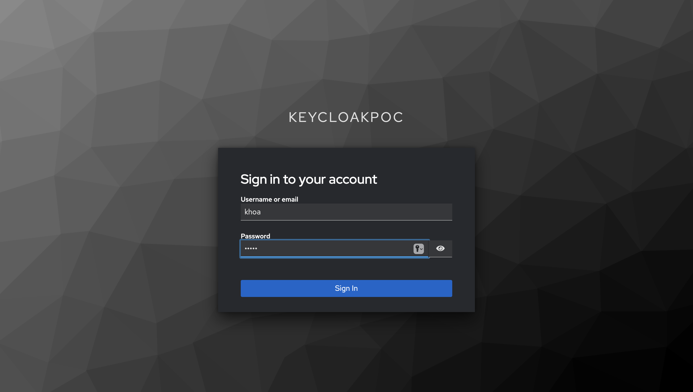
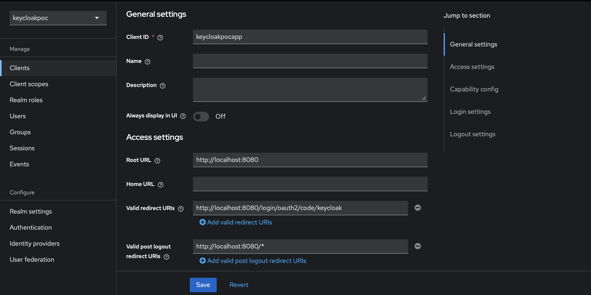
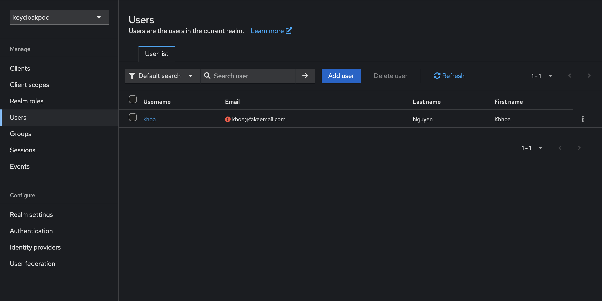

# KeycloakPOC

Spring Boot アプリケーションを **Keycloak** で OIDC (OpenID Connect) 認証する PoC です。
未認証で保護ページ (`/index`) にアクセスすると Keycloak のログイン画面へリダイレクトされ、
ログイン成功後に `/index` がレンダリングされることを確認します。

## 技術スタック

| 項目 | 内容 |
| --- | --- |
| Java | 21 |
| Spring Boot | 4.1.1 (spring-boot-starter-security-oauth2-client) |
| テンプレート | Thymeleaf |
| IdP | Keycloak 26.0 |
| DB | PostgreSQL 16 (Keycloak 用 / アプリ用) |

## アーキテクチャ / 構成

- **Spring Boot アプリ**: `localhost:8080`
  - `SecurityConfig` で全リクエストを認証必須にし、`oauth2Login` を有効化。ログイン成功後は `/index` へ遷移。
  - `MainPageController` が `/index` で Thymeleaf テンプレート `index.html` を返す。
- **Keycloak**: `localhost:9090`（コンテナ内 8080 → ホスト 9090）
  - realm: `keycloakpoc`
  - client: `keycloakpocapp`
- **PostgreSQL**: `localhost:5433`
  - Keycloak 用 DB: `keycloak`
  - アプリ用 DB: `kcdb`（`init-db/01-create-kcdb.sql` で作成）

## 主な設定値（`src/main/resources/application.properties`）

```properties
server.port=8080

spring.security.oauth2.client.registration.keycloak.client-id=keycloakpocapp
spring.security.oauth2.client.registration.keycloak.scope=openid,profile,email
spring.security.oauth2.client.registration.keycloak.authorization-grant-type=authorization_code
spring.security.oauth2.client.provider.keycloak.issuer-uri=http://localhost:9090/realms/keycloakpoc
```


## 起動手順

### 1. Keycloak と PostgreSQL を起動

```bash
docker compose up -d
```

- Keycloak 管理コンソール: http://localhost:9090 （admin / admin）
- PostgreSQL: `localhost:5433`

### 2. Keycloak 側の初期設定

管理コンソールで以下を作成します（下記スクリーンショット参照）。

1. Realm `keycloakpoc` を作成
2. Client `keycloakpocapp` を作成
   - Client authentication: ON（confidential）
   - Valid redirect URIs: `http://localhost:8080/login/oauth2/code/keycloak`
   - Credentials タブの Client secret を `application.properties` に設定
3. User を作成し、パスワードを設定（Credentials タブ）

### 3. Spring Boot アプリを起動

```bash
./mvnw spring-boot:run
```

## 動作確認（デモ）

### 1. 未認証で `/index` にアクセス → Keycloak ログイン画面へリダイレクト

ブラウザで http://localhost:8080/index を開くと、Keycloak のログイン画面へリダイレクトされます。



### 2. ログイン成功後、`/index` が表示される

作成したユーザーでログインすると `/index` に戻り、`ページへようこそ` が表示されます。


## Direct Access Grant によるトークン取得と UserInfo の確認

ブラウザのログイン画面を介さずに、ヘルパークラス（`KeycloakProbe`）から
**Direct Access Grant（`grant_type=password`）** でトークンを取得し、
そのトークンで `/userinfo` を呼び出してレスポンス構造を確認します。
（本番で ALB が担うトークン取得を、ローカル検証用に単純化したものです。）

> **補足**: このプローブで使用する Realm・Client・User（`test` / `testclient` / `khoa`）は、
> アプリ本体が使用する Realm・User（`keycloakpoc` / `keycloakpocapp`）とは**別物**です。
> レスポンス構造の検証のみを目的とした、テスト用の独立した設定です。

### 前提

- Client の **Direct access grants** を ON にする（OFF だとトークン取得が失敗）
- トークンリクエストに `scope=openid` を含める
  - 含めないと `id_token` が発行されず、`/userinfo` が **403** を返す
- `Authorization` ヘッダーは `"Bearer " + token` とし、`Bearer` の後ろのスペースを忘れない
  - スペースが無いとヘッダーが解釈されず、`/userinfo` が空ボディを返す

### 1. `/token` エンドポイントのレスポンス

`POST /realms/test/protocol/openid-connect/token`

```json
{
  "access_token": "eyJ...（JWT・省略）",
  "expires_in": 300,
  "refresh_expires_in": 1800,
  "refresh_token": "eyJ...（省略）",
  "token_type": "Bearer",
  "id_token": "eyJ...（省略）",
  "not-before-policy": 0,
  "session_state": "eea5f7a8-0871-41c4-b20f-fb553b4452a1",
  "scope": "openid profile email"
}
```

### 2. `/userinfo` エンドポイントのレスポンス（カスタム属性の追加前）

`GET /realms/test/protocol/openid-connect/userinfo`
（`Authorization: Bearer <access_token>`）

```json
{
  "sub": "c258b3d6-8345-4e8b-a0c8-317485c66413",
  "email_verified": false,
  "name": "Khoa Nguyen",
  "preferred_username": "khoa",
  "given_name": "Khoa",
  "family_name": "Nguyen",
  "email": "fakekhoaemail@gmail.com"
}
```

標準クレームのみが返ります。カスタムフィールド（部署・社員番号など）を返すには、
Client に **User Attribute マッパー**（Add to userinfo = ON）を追加する必要があります。

## Keycloak 設定のスクリーンショット

### Client 設定（`keycloakpocapp`）



### User 設定



---

